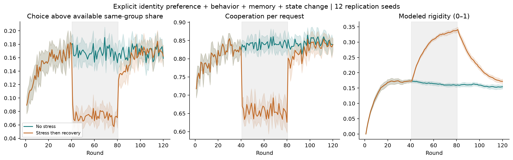

# Nous Volition · Streams and Rocks

This repository, **Streams and Rocks**, preserves the original stream-function report, physical-fluid experiments and separate social-organization studies.

## Fluid Organization Under Stress

**[Open the completed physical-fluid pilot](studies/fluid-organization/README.md).** It includes 93 paired fluid configurations, 7 inertial-particle configurations, 22 passing tests and the added dynamical-system controls. Marker history improves overall deformation prediction in the held-out pilot, but does not clearly improve the disturbance-specific response. Numerical failures and remaining questions are retained explicitly.

The [report and plots](studies/fluid-organization/report.html) are here in Streams and Rocks. **[Runnable code and complete data live in My-Sources-Project-ALL](https://github.com/NousVolition/My-Sources-Project-ALL/tree/main/reports/fluid-organization-pilot).** This is separate from the symbolic social SIMS models below.

## SIMS: names, memory, and group boundaries

**[Read the completed six-group SIMS study →](studies/social-organization/README.md)**

Ice, Water, Fog, Mist, Gas (water vapor), and Smoke are symbolic group labels in a
social analogy. **SIMS** are the simulated participants. The study includes 6,444 main/control simulations, 72 additional
diagnostic trajectories, numerical results, six charts, runnable Python scripts,
tests, and a proposed optional group-decision game.

- [Results and reproduction guide](studies/social-organization/README.md)
- [Accessible report](studies/social-organization/report.html) — download and open locally
- [Model and measurement specification](studies/social-organization/methods.html)
- [Optional group-decision game — proposed](studies/social-organization/human_protocol.html)
- [Recorded numerical outcomes](studies/social-organization/analysis/run_phase_metrics.csv)

Names alone changed nothing when semantic perception was disabled. In the full
model, combined stress reduced cooperation by 18.43 percentage points; memory
delayed rigidity recovery. These results describe the specified model's responses to stress and memory.

Current Navier–Stokes math, code, papers, and project status remain organized in
the separate project linked below.

## Review across both repositories

[Read the review and connections](https://github.com/NousVolition/My-Sources-Project-ALL/blob/main/REPOSITORY-REVIEW.md) for related identity/position, symmetry, persistence and prediction tests, together with unresolved work.

Repository CI now runs 250 dynamics/fractal/topology/heteroclinic/reversibility/SIMS-response/Hug/clay/orbit, 12 social-organization and 13 recovery/entrainment unit tests, plus source syntax, JSON, local Markdown links and the three published study manifests. These checks do not rerun the full ensembles or certify the scientific interpretations.

## Start here

**[Open the organized project →](https://github.com/NousVolition/My-Sources-Project-ALL/tree/main)**

The project guide on the main branch leads to the corrected smooth field, finished results, and next steps. The organization changes were merged in [pull request #1](https://github.com/NousVolition/My-Sources-Project-ALL/pull/1).

## Original report

[Read the Stokes stream-function report](stokes_stream_report.pdf).

The stream function constructs an initial velocity field. The original radial Gaussian has an axis cusp when the ring radius is positive. The [corrected smooth-field derivation](https://github.com/NousVolition/My-Sources-Project-ALL/blob/main/math/notes/smooth-initial-field.md) supplies the smooth replacement and exact energy formula.

The maintained implementation lives in the shared workspace. The original PDF is preserved here as a record of the earlier construction.

## SIMS follow-up: recovery, shared rhythms, and the arrangement

[Open the follow-up and worked model atlas](studies/sims-recovery-entrainment/README.md).
This adds 1,152 longer recovery runs, 576 oscillator-SIMS runs, and worked
calculations from the supplied mathematical pages: entrainment, Josephson dynamics,
pendulum energy and damping, topology, population models, and weakly nonlinear
oscillations. A later six-mode addendum adds 528 scheduled trajectories separating
initial-state forgetting, stored input history, and connection-dependent switching.
It also explains the supplied nine-state heteroclinic-network and entrainment figures.
A [Josephson solver and current-order comparison](studies/sims-recovery-entrainment/junction_methods.html)
adds damping-aware leapfrog, alternating and random current paths, and reset controls:
2,496 paths comprising 32,448 current-setting segments, plus fixed-start checks.
The package includes numerical results, tests, 22 original figures, and three offline
reports. The cropped textbook heteroclinic exercise awaits its missing equations.

## One position always fights back

[Open the resisting-position experiment](studies/one-resisting-position/README.md) for runnable simulations, saved results, assumptions, and volunteer-testing considerations. It compares a position that holds its initial color with one that actively opposes its neighbors, including ring and star networks and the difference between first and lasting agreement.

The study explores human coordination through nine **SIMS**, its simulated participants, using a Streams and Rocks analogy. The experiment runs independently using Python 3.12 and no third-party dependencies.

## Dynamics, fractals, and SIMS

[Open the dynamics and fractals test suite](studies/dynamics-fractals-sims/README.md) for eleven batches, including 12,800 binary-choice SIMS runs, 1,632 earlier continuous-response trajectories, 384 historical threshold-Hug trajectories, 384 current clay-SIMS trajectories, and 672 orbit-driven clay trajectories. These use different response rules, reported separately. The package covers continuous dynamics, finite fractals, tipping points, oscillations, topology, and heteroclinic switching.

The topology batch adds 39,056 bounded algebraic checks and 2,560 new SIMS runs comparing contact density, resisting positions, and filled faces. An exact counterexample shows why group totals can conceal different future coordination.

The heteroclinic batch tests saddle connections, 48 isolated nine-state trajectories, 64 starting states for a 16-unit pacemaker ring, local memory and interaction inference, and 12 sudden parameter changes. It includes independent controls, smaller-step comparisons, and explicit limits on what each experiment establishes.

The sixth batch checks a reversible system with an attractor, seven linear stability cases, transient growth, and 36 saved water-channel results using independent formulas and a separate discrete-mode calculation. It adds 22 tests and records the source data and limitations.

The seventh batch applies the supplied dynamics inside a continuous-state SIMS experiment: 20 participants follow linear, reversible, or driven-relaxation rules on three matched networks. It measures alignment separately from bounded attraction and choice agreement, tests a reversal intervention, and separates response speed from the final target. Its 1,632 trajectories and 24 additional mathematical/participant tests are documented in [the SIMS response methods](studies/dynamics-fractals-sims/SIMS_RESPONSE_METHODS.md).

The historical eighth batch locates and pins the earlier threshold-Hug equations, reproduces nine original checks, and applies lean, damping and pressure memory to 384 matched SIMS runs. It adds 72 separate numerical/reflection controls and reproduces the missed short-pressure-pulse failure. See [the Hug/SIMS methods and outcomes](studies/dynamics-fractals-sims/HUG_SIMS_METHODS.md).

The current ninth batch replaces the active Hug/SIMS response with the updated Burgers clay formula. It reruns 384 matched SIMS trajectories, adds 128 uncoupled comparisons and 24 independent solver controls, and verifies immediate deformation, delayed recovery and retained strain. The current model has no opening-at-1 trigger. See [the clay SIMS methods and results](studies/dynamics-fractals-sims/CLAY_SIMS_METHODS.md).

The tenth batch adds paired circular/reference-eccentric orbits for Pasiphae, Elara, Himalia, Europa, Callisto and Thebe. It applies six equal-mean eccentric loading signals and a shared circular control inside the current clay formula: 672 main SIMS runs, twelve orbital integration controls and twelve full-network solver checks. See [the orbital methods and outcomes](studies/dynamics-fractals-sims/ORBIT_METHODS.md).

The eleventh batch applies those orbital inputs directly to the current clay Hug: 28 material trajectories across four frozen coefficient sets and 28 independent solver controls. It tests deformation, recovery, retained strain, closed joins, enclosed area and work/energy balance; these add no participant runs. See [the direct Hug orbital-load test](studies/dynamics-fractals-sims/HUG_ORBIT_METHODS.md).

The package includes 250 automated tests, twenty-four original scientific figures, saved numerical results, and an [illustrated report](studies/dynamics-fractals-sims/report.html) to download and open locally. Equations, selected parameters, and links to primary sources are documented alongside the code.

