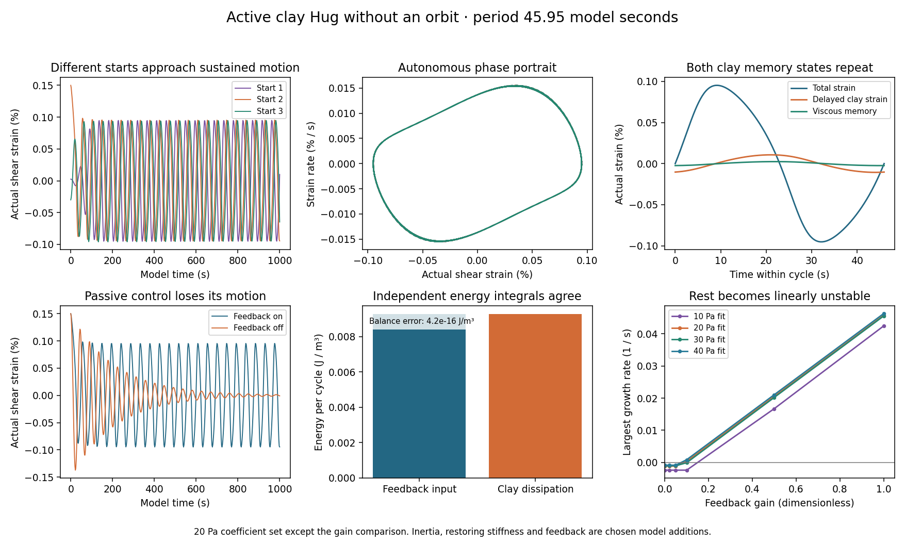
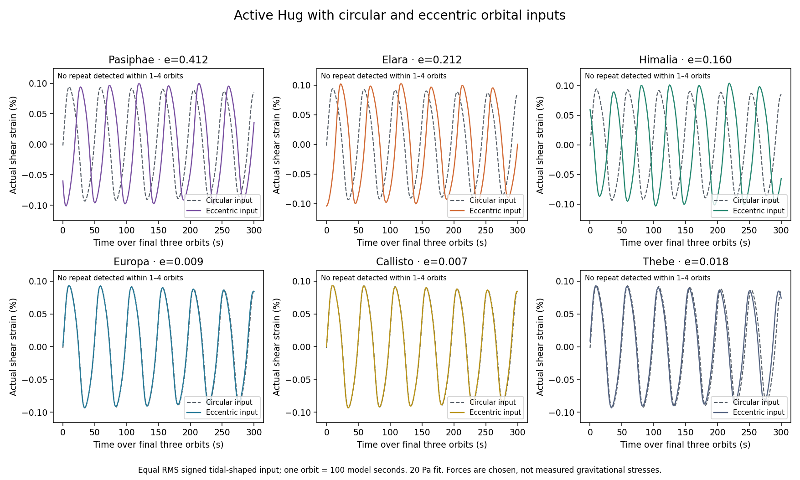
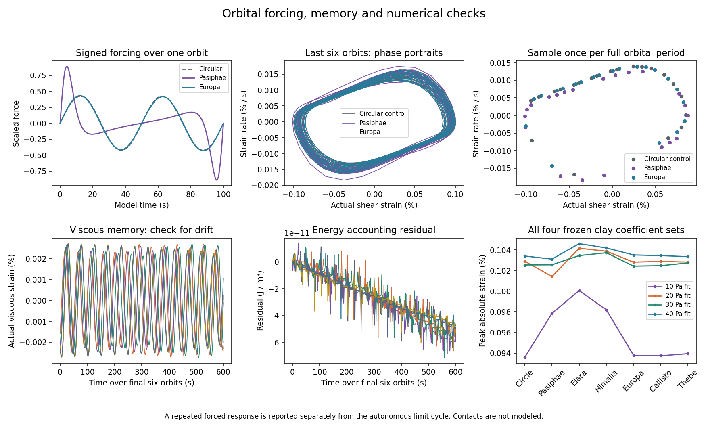
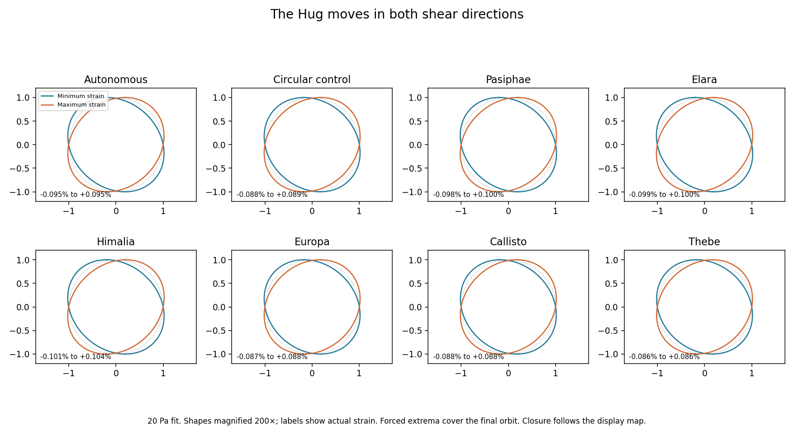

# Active Hug: autonomous motion before orbital forcing

This is a proposed active mechanical extension of the current clay Hug. It keeps the original Burgers material coefficients and internal equations. It adds **inertia, a parallel restoring stiffness and powered, amplitude-dependent feedback**. Those additions are chosen computational parameters, not measured properties of the clay or a physical actuator. Self-sustained motion requires an energy supply; the clay itself remains passive.

The fixed [protocol](active_hug_protocol.json), [implementation](active_hug.py), [saved outcomes](active_hug_results.json) and [21 additional tests](test_active_hug.py) specify the experiment. The previous prescribed-pressure test remains in [HUG_ORBIT_METHODS.md](HUG_ORBIT_METHODS.md). This batch changes neither its results nor the source clay files.

## Equations and units

Use one shear mode: total engineering strain gamma, strain rate, delayed clay strain u and viscous memory w. The stress is now a response to deformation rather than a prescribed pressure:

```text
sigma = G_M (gamma - u - w)
u_dot = (sigma - G_K u) / eta_K
w_dot = sigma / eta_M

I gamma_ddot + k gamma + sigma
    = c [1 - (gamma/gamma0)^2] gamma_dot + s_orbit(t)
```

I is an effective inertial stress coefficient, with units Pa s². k is a parallel restoring stiffness in Pa; it restores a resting shape even when the Maxwell dashpot relaxes. c is an active coefficient in Pa s. This is a modal mechanical equation, not a full elastic body or contact calculation. The additional feedback supplies energy at small displacements and removes energy at large displacements; gamma0 is the feedback transition, **not a prescribed final amplitude**.

Scaled time tau=t/t0 and states (x,v,U,W)=(gamma/gamma0, dx/dtau, u/gamma0, w/gamma0) give:

```text
s = x-U-W
x' = v
v' = -kappa x - s + mu (1-x²) v + f(tau)
U' = a [s-r U]
W' = b s

r=G_K/G_M, a=t0 G_M/eta_K, b=t0 G_M/eta_M
I=G_M t0², k=kappa G_M, c=mu G_M t0
```

Here t0=10 model seconds, gamma0=0.0005, kappa=1, and mu=1. Each of the four frozen 10/20/30/40 Pa source fit rows is used separately. The labels identify coefficient fits; they do not mean those nominal stresses are imposed in this experiment. There is no interpolation between fits. The chosen inertia scales with G_M, so comparisons across rows change several parameters together and do not isolate a causal material effect.

The source law and its provenance remain in [CLAY_SIMS_METHODS.md](CLAY_SIMS_METHODS.md). Signed cyclic loading and the new mechanics extend beyond its original stepped-creep calibration. The standard feedback mechanism is described by [Kanamaru's van der Pol article](https://www.scholarpedia.org/article/Van_der_Pol_model). The clay memory makes this a four-state system: the planar Liénard theorem in the screenshots does not establish existence or uniqueness for this extension.

## First: no orbit

Twelve autonomous trajectories use three different starts for each coefficient row: small displacement, large displacement, and a signed state with nonzero memory. Every autonomous trajectory runs to tau=1200 (12,000 model seconds); passive controls run to 10,000 seconds. An exact resting state stays at rest deterministically, even when linearly unstable; a seed disturbance is needed. Initial shorter horizons were insufficient for a kicked memory state and the slowest autonomous start to meet the return gates. The final protocol extends settling time while retaining the original accuracy gates. All twelve completed autonomous paths were continued from their full final states, including cumulative energy accounting, to the same extended horizon; orbital paths were preserved.

Positive crossings of x=0 define a phase section. Late successive crossings must agree in **all four states** and in period. A shooting solve then closes all four state equations over one period, fixing x=0 to remove phase freedom. This prevents a closed-looking position/velocity curve from hiding memory drift.

The analytic four-state Jacobian supplies the variational equation. One Floquet multiplier represents phase and should be one; the other three must have modulus below one. These are numerical stability checks for the computed cycle, not a global uniqueness proof. See [periodic-orbit stability](https://www.scholarpedia.org/article/Periodic_orbit). Four additional kicked-cycle controls perturb velocity and both memory states and evolve for 400 computed periods; their final section points must return toward the computed cycle.

Four passive controls set mu=0 from the large start and must dissipate their motion and approach rest. Twenty-four gain controls compute the rest-state eigenvalues at six gains across four coefficient rows. A bracketed root locates a complex-eigenvalue stability crossing. This is a **linear instability threshold**; no nonlinear Hopf coefficient or global bifurcation classification is asserted.

## Then: circular and eccentric orbital inputs

Twenty-eight forced trajectories use seven distinct signals for each coefficient row: a shared circular baseline, plus Pasiphae, Elara, Himalia, Europa, Callisto and Thebe eccentricities from the already pinned [JPL mean-element protocol](orbit_protocol.json). Every case uses the same small initial state and 10,000-second horizon, giving 100 model orbits. Actual astronomical periods are not used in this response experiment.

```text
E-e sin(E) = 2 pi t/P
r_orbit/a_orbit = 1-e cos(E)
cos(nu) = (cos(E)-e)/(1-e cos(E))
sin(nu) = sqrt(1-e²) sin(E)/(1-e cos(E))

psi = (a_orbit/r_orbit)^3 sin(2 nu)
f = beta psi / RMS_time(psi)
```

P=100 model seconds and beta=0.3. Each signal has zero mean and RMS beta, calculated over a complete orbit in **time**, rather than uniformly in true anomaly. This equal-RMS comparison isolates waveform shape within the chosen model; it deliberately removes physical differences in absolute tidal strengths. The shear projection is in a fixed nonrotating body frame, with periapsis at time zero. The circular signal has half-orbit period because of its quadrupolar projection. Eccentric signals have the full orbit period.

This signed, inverse-cube, tidal-shaped drive replaces the positive inverse-square pressure waveform only **in this new active experiment**. It is not a physical gravitational stress calculation: body size, density, actual inertia, spin, orientation evolution, spatial deformation and actuator calibration would be needed for that. Tidal-force context: [University of California, San Diego lecture derivation](https://hepweb.ucsd.edu/ph110b/110b_notes12.pdf).

Full-state samples taken at the same phase once per complete orbit check repetitions over one through four orbits. A repeat is reported only when all four states agree within 1e-5 scaled units over the last ten paired samples. Otherwise the result is explicitly "no repeat detected within 1-4 orbits". This finite-horizon diagnostic does not establish chaos, quasiperiodicity, or a globally attracting forced solution. The reported positive-crossing rate is a motion-frequency diagnostic, not proof of phase locking. No forced Floquet classification is claimed.

## Energy and numerical controls

Energy per unit volume, scaled by G_M gamma0², is:

```text
E = [v² + kappa x² + (x-U-W)² + r U²]/2
E' = mu (1-x²) v² + f v - (U'²/a + W'²/b)
```

The integrator carries feedback work, orbital work and clay dissipation as three additional accounting states; these do not feed back into the four motion states. Stored-energy change must equal input work minus dissipation over the entire run. Autonomous cycle work and loss are also calculated independently by quadrature on the variational trajectory. Clay loss is nonnegative. The active feedback can absorb energy during part of the cycle as well as supply it.

Thirty-two **separate Radau controls** check the final 200 model seconds for every coefficient row and each autonomous/forced input. They start from the same saved late state and retain the same orbital phase. They check the late numerical trajectory; they are not independent reruns of the entire 10,000-second transient. Periodic shooting uses tighter tolerances and smaller maximum steps. All solver and cycle accuracy gates are fixed in the protocol; failed cases are not discarded.

Counts are **40 main direct Hug trajectories** (12 autonomous and 28 forced), four passive controls, four kicked-cycle controls, 32 Radau segment controls, four periodic shooting/variational calculations and 24 algebraic gain checks. These add **zero SIMS participant trajectories**. The cumulative participant count remains 15,872.

## Display and reproduction

The completed autonomous cycles have periods **46.706, 45.949, 46.111 and 45.980 model seconds**, in 10/20/30/40 Pa coefficient-row order. Largest transverse Floquet moduli range from 0.8931 to 0.9607. All three starts per row approach the computed full-state cycle; the largest final section discrepancy is 2.83e-6 scaled units. Kicked-cycle return errors are below 5.7e-9. The largest independent Radau state discrepancy is below 1.9e-9 scaled units. All 271 study tests pass locally.

Orbital repetition is **not imposed as a success criterion**. In the 10 Pa coefficient set, the circular, Europa, Callisto and Thebe cases repeat within one full orbital period at the declared tolerance. The other 24 forced cases do not repeat within one through four orbits during the measured tail. In particular, none of the 20 Pa forced cases in the principal comparison figure passes that repeat test. This establishes a finite-horizon observation of modulation, not a diagnosis of chaos or proof that a longer-period response is absent.

All strain curves show actual strain. The original two-arm outline is sheared only for illustration, using the unchanged display map. The shape figure uses 200 times magnification and labels actual strain. Its joined tips remain joined by construction; no contact strength, slip, opening, fracture or full spatial-body dynamics is modeled.






```sh
python -m unittest -v
python active_hug.py --check
python active_hug.py
python active_hug_report.py
```

The first command checks the complete study. The second reruns the active experiment, compares cycles and forced tail states against the saved results and reapplies all gates. The third regenerates the saved active data. The fourth rebuilds its four figures. `build_report.make_html()` updates the illustrated report without regenerating earlier figures. Repository publication is separate from website deployment.
