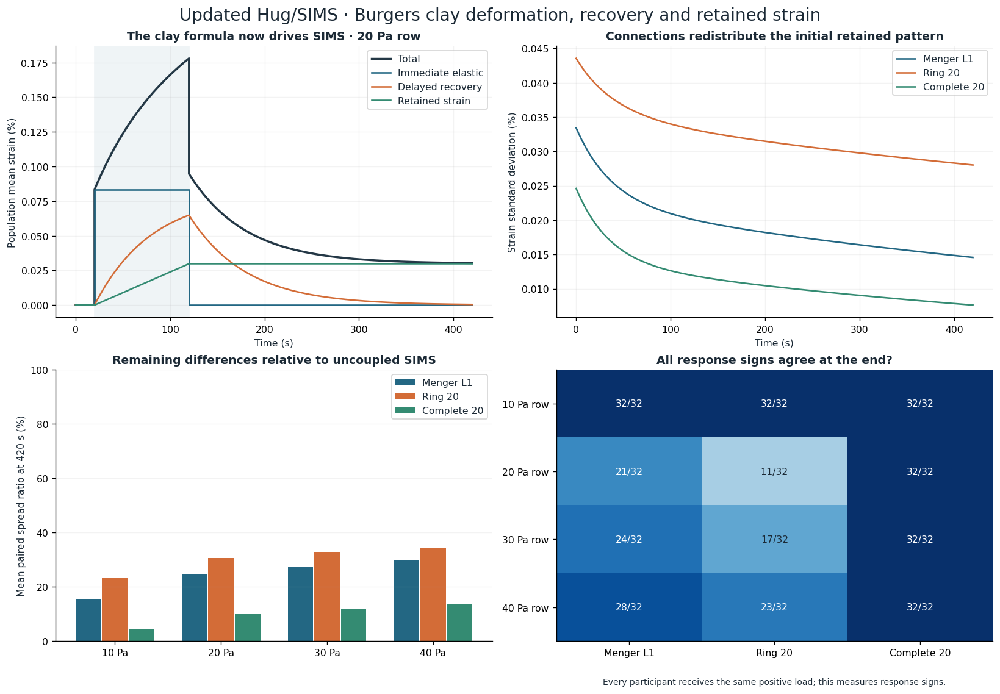

# Current Hug/SIMS: the clay formula

The active Hug/SIMS experiment now uses the wet-kaolin Burgers formula from the located `hug-clay` update. **384 new clay-based SIMS trajectories, 128 uncoupled comparisons, and 24 independent solver runs are complete. All 211 tests pass**, including 24 added clay tests. The [older Hug experiment](HUG_SIMS_METHODS.md) remains a historical comparison with its original equations and results; its opening threshold is not part of this clay model.

## Located source and material formula

The [original clay implementation](clay_source/clay_model.py), [four fitted coefficient rows](clay_source/source-data/cooke-2012-table-1.csv), and [source provenance](clay_source/source-data/provenance.json) are copied byte for byte from the user's local `2026-10-05/ca/outputs/hug-clay` package. [Snapshot hashes](clay_sources.json) identify exactly what was used. That update was not present on the source repository's main branch when inspected; this package publishes the source snapshot needed to reproduce these tests.

For constant shear stress σ, with t measured from loading:

```text
γ(t) = σ/G_M + (σ/G_K)(1 − exp(−G_K t/η_K)) + σt/η_M.
```

The three terms are immediate elastic strain, delayed Kelvin strain u, and retained Maxwell dashpot strain w. Upon release, the elastic part jumps back, u decays with time constant η_K/G_K, and w stays constant for an uncoupled sample. Under an arbitrary specified local stress, the equivalent internal equations are:

```text
γ = σ/G_M + u + w
u′ = (σ − G_K u)/η_K
w′ = σ/η_M.
```

Moduli G are in Pa, viscosities η in Pa·s, time in seconds, and engineering shear strain γ is dimensionless. There is no added factor of two. Coefficients are the four published fits at 10, 20, 30 and 40 Pa in [Cooke and van der Elst (2012), Table 1 and equation 1](https://agupubs.onlinelibrary.wiley.com/doi/full/10.1029/2011GL050186). These are fitted values from a stepped, history-dependent experiment, not four raw independent trajectories. This demonstration uses each row separately with the chosen pulse schedule and does not interpolate between rows or validate arbitrary clay histories.

## Applying the formula to SIMS

One SIM now has two internal strain states u and w; its expressed response is total strain γ. The old lean velocity, pressure imprint, cubic force and opening trigger are absent. Each of the 20 SIMS receives the same external shear-load pulse s: zero until 20 s, the nominal row stress through 120 s, then zero through 420 s.

Neighbor coupling is an explicit added rule:

```text
σ = s − K L γ
(G_M I + K L) γ = s + G_M(u+w)
K = 2 G_M.
```

L is the symmetric Laplacian of the Menger level-1, ring, or complete graph, with adjacency divided by maximum node degree as in earlier SIMS batches. Neighbor forces sum to zero and resist differences in total response. K is a chosen interaction strength; the wet-kaolin fits do not calibrate this network law. Internal stresses can differ from the nominal row stress. Consequently these coupled runs test a specified SIMS response mechanism, not measured collective clay behavior or a new physical material fit.

Every graph and material row reuses 32 seeds, 20261020–20261051. Initial Kelvin strain is zero. Initial retained strain is 0.002 times the centered first coordinate of the batch-7 seeded array, giving zero population mean and small signed residual patterns. The initial elastic state balances the coupling, so different networks can already have different total strain at t=0. Matching is on the internal retained pattern, not on a falsely claimed identical total-strain array. The old velocity coordinate is not reused because this constitutive model has no inertial state.

The **384 main runs** are 4 coefficient rows × 3 networks × 32 retained patterns. **128 uncoupled runs** reuse the same internal patterns with K=0. They are controls and are not counted again for each graph. **24 independent solver runs** use the first seed for each graph/row with both DOP853 and Radau. The design and gates were saved in [the protocol](clay_sims_protocol.json) before running.

## What the rerun shows

The collective mean follows the source clay formula on every graph because uniform coefficients and reciprocal coupling preserve the mean equation. After loading ends, the mean Kelvin component recovers, while the mean retained component remains. Individual retained components can continue changing under internal neighbor stress even after external unloading. Connected networks eventually remove nonuniform difference modes; these finite-time results do not imply that the remaining differences last forever.

For the **20 Pa coefficient row**, the mean paired ratio of final spread to the corresponding uncoupled spread is:

| Network | Remaining spread at 420 s | Runs with unanimous final response signs |
| --- | ---: | ---: |
| Menger L1 | 24.56% | 21/32 |
| Ring 20 | 30.67% | 11/32 |
| Complete 20 | 9.98% | 32/32 |

At 420 s the common population mean strain for that row is 0.030288%; its infinite-time retained mean is 0.029851%. The other rows and every outcome are preserved in [the results](clay_sims_results.json). The largest sampled absolute individual strain is about 0.43556%. Differences between rows reflect changes in both stress and fitted coefficients, so these runs do not isolate a causal effect of increasing stress alone.



## Measurements and numerical verification

Absolute spread is the standard deviation of total strain across participants. For consistency with the earlier measurement functions, we also normalize γ by γ★=σ_nominal×100/η_M, the source's final retained strain. Sign unanimity means every normalized response is above +0.02 or every response is below −0.02. Near zero is undecided. Every SIM receives the same positive load, so shared positive signs are an expected response to the forcing and do not demonstrate voluntary agreement. The old displacement and velocity units are not numerically comparable with these strains.

The solver uses exact affine modal evolution. For graph eigenvalue λ, put h=1/(1+2λ) and R=G_M(1−h). Then the internal-state matrix is

```text
A = [[−(R+G_K)/η_K, −R/η_K],
     [−R/η_M,       −R/η_M]].
```

Scaling the coordinates by diag(√η_K,√η_M) makes this matrix symmetric. Its exponential and affine integral are evaluated through real eigenmodes, retaining the zero-rate uniform dashpot mode exactly. No fixed integration step is needed. The output is sampled every second and includes both left and right limits at 20 and 120 s. Internal states are continuous through those jumps; total strain includes the instantaneous elastic jump. Initial states, final components, per-run measurements, first-seed summary traces and all controls are saved. Full internal trajectories can be regenerated from the source and protocol.

Independent full-coordinate DOP853 and Radau integrations split exactly at the load changes, using relative tolerance 1e−10, absolute tolerance 1e−13 and maximum step 2 s. Their largest strain discrepancy is **4.87e−14**, against the fixed 1e−9 gate. The maximum collective-mean discrepancy from the source formula is **4.78e−18**, against 1e−12.

Energy includes both clay spring storage and neighbor interaction:

```text
E = G_M Σeᵢ²/2 + G_K Σuᵢ²/2 + K γᵀLγ/2
E′ = sᵀγ′ − Σ(η_K uᵢ′² + η_M wᵢ′²).
```

At a load jump, work is (s_before+s_after)ᵀΔγ/2. Across constant-load intervals, work follows the endpoints; dissipation is integrated independently with 64-point Gaussian quadrature. The maximum energy-budget residual over all main starts is **6.22e−15**, against the fixed 1e−8 gate. Energy here sums the model's per-participant densities; it is not a measured energy of a physical group.

The 24 new tests verify source hashes and coefficients, the constitutive formula, zero load, exact jumps, recovery and retention, uncoupled and uniform reductions, reciprocal force balance, relabeling, reflection, joined shear geometry, an independent full matrix exponential, composition of time intervals, decay modes, energy, independent ODE solutions, matched seeds and reproduction checks. The complete suite has **211 tests**. Full reruns compare main numerical outcomes tightly while reapplying the original accuracy gates to adaptive error diagnostics.

## Current model and historical results

The original closed Hug outline remains joined under the affine shear display. The active equations have no opening-at-1 condition, pressure field, venting rule or inertial buckling. They represent small-strain material response with a declared SIMS interaction. Large molding, changing contact and fluid coupling require additional equations and validation.

The older 384 Hug trajectories remain labeled historical, with their source and regression tests intact. The cumulative archive now contains 15,200 main SIMS runs: 12,800 binary, 1,632 earlier continuous, 384 historical threshold-Hug, and 384 current clay-SIMS. The 128 uncoupled comparisons and 24 solver controls are additional and separately counted.

## Reproduce the current clay experiment

```sh
python -m pip install -r requirements.txt
python -m unittest -q
python clay_sims.py --check
```

Use `python clay_sims.py` to regenerate all clay outcomes and controls. `python build_report.py` rebuilds the illustrations and report. The earlier `hug_sims.py` command reproduces the explicitly historical threshold model; it does not run the current clay experiment.
