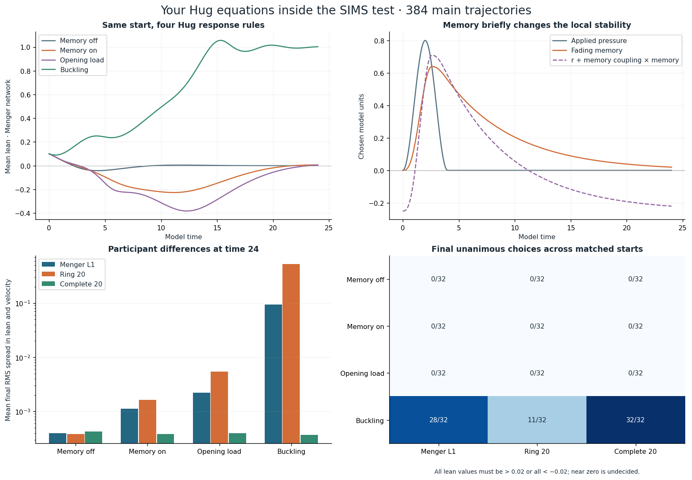

# Your Hug files tested inside SIMS

The located Hug work is in [My-Sources-Project-ALL](https://github.com/NousVolition/My-Sources-Project-ALL/tree/b20d1dcf25fb7e97bcceb9a09d0883d30bf08e8c), pinned here to commit `b20d1dcf25fb7e97bcceb9a09d0883d30bf08e8c`.

| Located files | What they supply here |
| --- | --- |
| [Original timed geometry](hug_source/source/hug_envelope.py) | Mirror arms, closure and reciprocal axis stretch; original assertions rerun unchanged. |
| [Original pressure memory](hug_source/source/pressure_envelope.py) | Loading/recovery memory, irreversible opening and preserved area; original assertions rerun unchanged. |
| [Reduced Hug dynamics](hug_source/hug_model.py) | Lean, velocity, pressure-dependent stiffness, cubic restoring force, damping, work and dissipation. |
| [Hug-shaped fluid initialization](https://github.com/NousVolition/My-Sources-Project-ALL/blob/b20d1dcf25fb7e97bcceb9a09d0883d30bf08e8c/math/hugged_ring.py) | Located and distinguished from the reduced model. This batch adds no fluid evolution runs. |
| [Later Hug stress study](https://github.com/NousVolition/My-Sources-Project-ALL/tree/b20d1dcf25fb7e97bcceb9a09d0883d30bf08e8c/reports/hug-stress) | Its missed-pulse finding is reproduced as a failure control; the full stress and Lorenz sweeps are not repeated here. |

Five source files, including nine original test functions, are copied byte for byte from the located local Hug package. Every copied file matches its GitHub blob hash at the pinned commit. [Provenance and SHA256 values](hug_sources.json) record the verification. The new files implement experiments and checks; none of the supplied screenshots are copied into the repository.

## What changes inside SIMS

The local reduced Hug equations are vectorized and checked directly against the unchanged original right-hand side. One Hug response becomes one SIM's lean q, velocity v, and memory m. The added interaction is a reciprocal force toward neighboring lean values:

```text
q′ = v
v′ = (r + c m)q − q³ − d v − k Lq
m′ = (p(t) − m) / τ
τ = 0.8 when p(t) > m, otherwise 6
p(t) = P sin²(πt/4) for 0 < t < 4, otherwise 0
k = 2
```

L is the same symmetric graph Laplacian used in batch 7: adjacency is divided by maximum degree before forming L. Graphs are Menger level 1, a ring, and the complete graph, each with 20 SIMS. This interaction is a new declared modeling choice; it is not derived from fluid motion. Pressure is uniform, so memory is shared when every participant starts with zero memory. Local pressure history and lean dynamics still remain distinct variables.

The [fixed protocol](hug_sims_protocol.json) uses the same 32 seeds and starting lean/velocity arrays as batch 7, with population mean (0.1, −0.04). Every graph and condition reuses those arrays. That initial positive lean is a specified bias; pressure alone supplies no preferred sign. Reflection controls negate both lean and velocity. Exactly balanced controls remain balanced even when their equilibrium is unstable.

| Condition | r | Damping d | Peak pressure P | Memory coupling c |
| --- | ---: | ---: | ---: | ---: |
| Memory off | −0.25 | 0.6 | 0.8 | 0 |
| Memory on | −0.25 | 0.6 | 0.8 | 1.5 |
| Opening load | −0.25 | 0.6 | 1.2 | 1.5 |
| Buckling | 1 | 0.6 | 0 | 0 |

There are **384 main trajectories** (4 × 3 × 32), evolved to time 24 with RK4 step 0.01 and sampled every 0.1. The original model's step routine is reused. All outcomes, final lean/velocity arrays and sample-based measurements are in [the results](hug_sims_results.json). First-seed mean/spread traces are saved for every condition and graph. All full paths can be regenerated from the saved protocol; only those representative traces are stored in full summary form.

There are **72 separate control trajectories**: 24 at step 0.005, 24 reflected, and 24 adaptive (DOP853 and Radau for the first start in each graph/condition). These do not inflate the main count. The four additional short-pulse calculations described below are also separate. The package now contains 14,816 main SIMS trajectories: 12,800 binary, 1,632 earlier continuous, and 384 Hug-based runs.

## Results

In the three pulse conditions, all SIMS on every graph lie within the undecided interval [−0.02, 0.02] at time 24. The memory initially makes the effective coefficient r+c m positive, but then fades. The transient amplification does not constitute a lasting chosen side in these cases.

The buckling condition keeps r=1 after the start. Final unanimous choices occur in **28/32 Menger**, **11/32 ring**, and **32/32 complete-network** runs. Mean final RMS spread of lean and velocity is 0.09471, 0.52050, and 0.0003687 respectively. These are finite-time outcomes over the specified starts, not a claim that all remaining paths stay split forever. The sampled peak absolute lean averaged over Menger starts increases from 0.6707 in Memory on to 0.9306 in Opening load. Changing the pressure also changes the forcing history; opening itself has no feedback in these equations.

Choice unanimity requires every lean above +0.02 or every lean below −0.02. Near-zero alignment counts as undecided. The earlier [SIMS measurement definitions](SIMS_RESPONSE_METHODS.md) also distinguish first agreement, later breaks, coordinate spread and the collective state. Peak and first-agreement measurements use the 0.1 sample grid.



## Mathematical and numerical checks

For fixed m=0, a Laplacian mode λ near q=v=0 has characteristic polynomial

```text
z² + d z + k λ − r = 0.
```

The collective mode λ=0 retains the single Hug's stability. Coupling can stabilize difference modes without stabilizing a positive-r collective mode. The cubic term makes this nonlinear model different from the unbounded linear growth controls in batch 7. Uniform populations and zero coupling reproduce the single-Hug dynamics; vectorization is checked in both memory branches.

The stored energy includes the reciprocal coupling:

```text
E = Σ(vᵢ²/2 − r qᵢ²/2 + qᵢ⁴/4) + k qᵀLq/2
E′ = Σ(c mᵢ qᵢ vᵢ − d vᵢ²).
```

The source work and loss variables integrate those two terms. The largest residual E−E(0)−work+loss is **1.30e−8** across all 384 main runs. The largest coarse/fine state difference is **2.28e−6**; RK4 versus DOP853 is **2.35e−6**; DOP853 versus Radau is **1.41e−8**. Reflection error is zero to the recorded precision. These pass the protocol's 2e−5 state, 2e−6 budget, and 1e−11 reflection gates. Controls cover predefined starts; they do not establish numerical error bounds for every possible configuration.

**187 tests pass**, comprising the previous 162, sixteen new checks, and nine unchanged original Hug tests. New checks cover source hashes, original RHS and trajectory agreement, uniform states, graph relabeling, reflection, net coupling force, mode stability, energy, independent integration, bounded memory and exact recovery, balance, opening, pulse resolution, and the saved matched design.

A complete replay reproduces the main outcomes within relative tolerance 1e−9 and absolute tolerance 2e−12. Three adaptive-solver discrepancy estimates shift by at most 3.85e−11 when the linear-algebra thread setting changes. These are differences between solvers, not changed SIMS outcomes. The reproduction check therefore reapplies the original accuracy gates to numerical-error diagnostics while keeping the tight comparison for main outcomes. The pulse solver comparison must remain below the 2e−8 tolerance used by its executable test. [Replay verification](hug_sims_reproduction.json) preserves the observed changes; the original results are retained.

## A reproduced failure control

With peak pressure 100 and pulse duration 0.001, the original fixed steps 0.02 and 0.01 both miss the pulse and record zero memory. Independent adaptive solutions, explicitly split at the pulse end, give a sampled peak memory **0.06246132**, agreeing to **3.32e−11** in the full state. Two coarse calculations agreeing with one another would not detect this failure. The main experiment resolves its four-unit pulse, and the new fixed-step entry point rejects the unresolved 0.001 pulse at those coarse steps.

## Opening and interpretation

The original threshold p≥1 remains a latched geometry rule, with opening time `4/π × asin(sqrt(1/P))` for P≥1. Opening completes over 0.8 time units and does not reverse when pressure drops. The model retains the prescribed pressure after opening; it does not vent, break SIMS connections, add a wall force or solve permeability. The Hug's shear and reciprocal axis scaling are drawing rules and do not enter the added neighbor force.

This batch tests the reduced Hug mechanism and an explicit use of it inside SIMS. It does not equate those participant rules with a physical fluid or rerun the full Navier–Stokes model. The located Lorenz-driven extension is recorded for further comparisons but is not included in these run counts.

## Reproduce

```sh
python -m pip install -r requirements.txt
python -m unittest -q
python hug_sims.py --check
```

Use `python hug_sims.py` to regenerate all 384 main outcomes, the 72 controls, and the four pulse calculations. For these small systems, setting `OPENBLAS_NUM_THREADS=1` and `OMP_NUM_THREADS=1` avoids thread overhead. `python build_report.py` rebuilds the figures and report. [SciPy's solve_ivp documentation](https://docs.scipy.org/doc/scipy/reference/generated/scipy.integrate.solve_ivp.html) describes the two independent integration methods.
