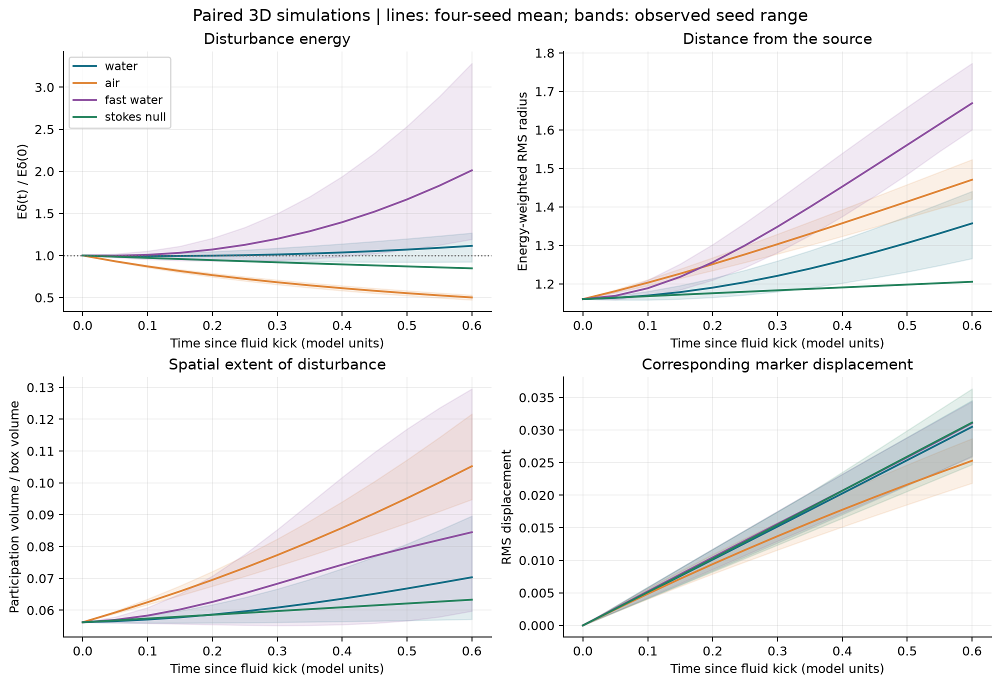
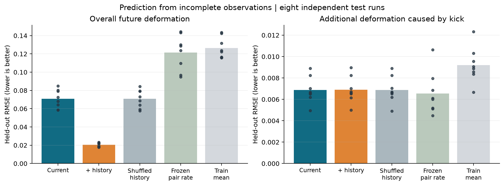

# Fluid Organization Under Stress: completed pilot

## Completed circuit follow-ups and 120-field fluid confirmation — 10 October 2026

[Read the completed experiments and linked code](extensions/josephson-followups/README.md). Longer and whole-cycle observations, stepped/continuous ramps, dimensionless noise and mismatch, capacitance, and held-out forecasts have been run. A separate confirmation uses **120 new fluid starting fields** and frozen models. The larger independent fluid test did not resolve a prediction advantage from the declared history features. Mean error change with history: **+9.41%**, paired 95% interval **[-3.98%, +26.38%]**; positive values mean increased error. The interpretation is limited to the specified global flow summaries, predictors and simulated regime; laboratory calibration, LRC/general-capacitance dynamics, other media and physical circuit-to-fluid transfer remain proposed.

## Completed Josephson voltage sweep — 10 October 2026

[Read the sweep results, plots and source-code links](extensions/josephson-sweep/README.md). The experiment includes upward/downward sweeps, fresh starts, all four time-step/settling combinations, separate voltage averaging windows, and further convergence checks. Original numerical failures are retained alongside refined results. Eighteen automated tests pass; finite-time phase-history effects are not presented as a new physical memory law or fluid result.

## Completed recovery and network extension — 10 October 2026

[Read the new experiments, results and code links](extensions/recovery-network/README.md). This separate extension adds 36 three-arm fluid recovery runs, a specified three-state network with frozen learning controls, independent test runs, and 14 passing automated tests. It does not alter the original pilot results. The intervention-specific fluid history benefit remains unresolved.

Does past marker organization help predict a fluid's response to a local disturbance?

This is a physical-fluid pilot, separate from the social SIMS studies. Completed work comprises **93 paired fluid configurations**, **7 particle-tracking configurations**, and **22 passing automated tests**, with separate phase-locking, linear-system, pendulum, relaxation, weakly nonlinear, parametric-forcing and bifurcation controls.

## Main result

Across eight held-out initial conditions, adding past marker geometry reduced mean per-run RMSE for overall future neighborhood deformation from **0.07082 to 0.02040 (71.19%)**. The paired whole-run bootstrap interval for the RMSE difference was **[-0.05664, -0.04431]**. Shuffling histories removed the benefit, and the finer-grid check preserved it.

For the **additional deformation caused by the disturbance**, history did not demonstrate an improvement: RMSE changed from **0.006877 to 0.006897**, with an interval for the difference spanning zero. The first result therefore does not establish the main disturbance-response hypothesis. History can help infer state missing from an instantaneous local observation; it is not evidence for a new physical memory force.

## Scope and numerical limits

- Three-dimensional incompressible Navier–Stokes in a periodic box, smooth matched initial conditions, identical baseline/disturbed copies and a localized divergence-free impulse. Markers are passive, not interacting molecules.
- Assigned water and air viscosities, forcing and speed controls, independent random starts, half-time-step and finer-grid comparisons. A Stokes ablation is explicitly a mathematical control.
- Fog and idealized smoke are dilute inertial particles carried by air, with gravity present/removed. Fixed droplets, no evaporation, condensation, combustion or two-way coupling.
- Perturbation energy can grow by transfer from background flow while total unforced kinetic energy falls. Marker separation alone does not establish amplification.
- The original fast-water coarse-grid marker comparison **failed**: RMS change 0.03482 against a 0.005 screen. For one seed, the 50-to-62-grid continuation passed at 0.003797. This does not validate every stress realization or prove continuum convergence.
- Ice, phase changes, wall-boundary comparisons and broader stressful regimes remain proposed. The finite-dimensional examples are established mathematical controls, not evidence of a fluid bifurcation or a solution to the Clay problem.

## Read the study

- [Illustrated report](report.html) — download and open locally with its companion files.
- **[Runnable Python code, automated tests and full raw data → My-Sources-Project-ALL](https://github.com/NousVolition/My-Sources-Project-ALL/tree/main/reports/fluid-organization-pilot)**
- [Quantitative parameter table](results/parameter_regimes.csv), [all runs](results/all_runs.csv), [prediction scores](results/prediction.json)
- [Numerical controls](results/numerical_controls.csv), [stress continuation](results/stress_extension.json), [saved-data verification](results/verification.json)

## How the repositories connect

Streams and Rocks holds this report, result tables, figures and supplied reference excerpts. The linked source repository holds the executable implementation, tests, protocols and **all** recorded arrays needed to audit or reproduce the work. The verification record here refers to that complete source package. The report's reproduction commands must be run inside the linked source directory.

The code reuses pinned Fourier operators from the existing Navier–Stokes research. The report identifies which mechanisms are established physics, which predictions were measured, and which experiments remain unanswered. The textbook images are user-supplied references; their cropped content is not treated as evidence that the fluid undergoes the same transition.

## Added heteroclinic-network reference

[Identified source, nine-saddle diagram, oscillator equation and proposed tests](network_reference_addendum.html). This reference addendum is not an additional completed simulation.
