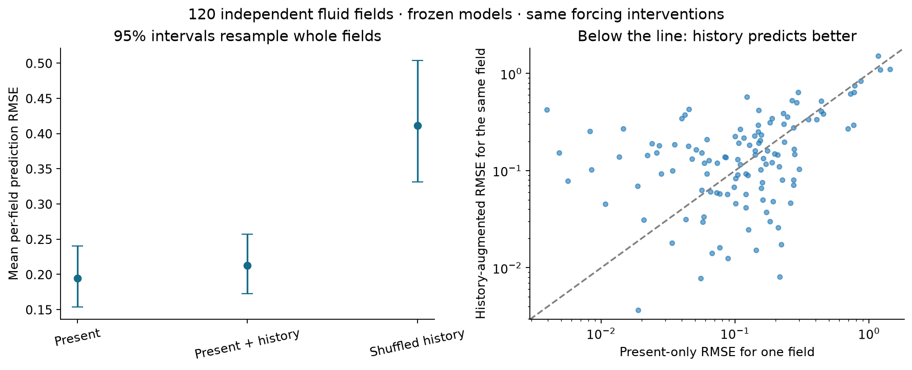
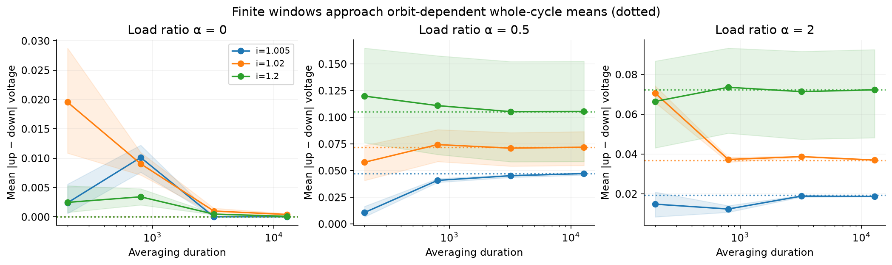
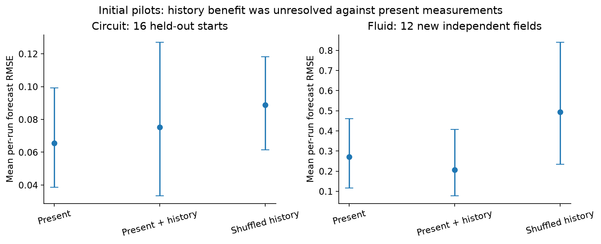

# Josephson follow-ups and independent fluid forecast replication

## Larger independent fluid confirmation

**This larger test did not resolve a history advantage over present measurements.** The new test used **120 independent starting fields**, each cloned into three forcing arms, with the prediction models frozen beforehand.

- Present-only mean RMSE: **0.194456**.
- Present + history mean RMSE: **0.21276**.
- Paired difference: **0.0183042 [-0.00841824, 0.0457309]** (95% interval, 20,000 whole-field bootstrap resamples).
- Relative mean-error change with history: **+9.41%** [-3.98%, +26.38%]; positive means increased error.
- Numerical controls: **all passed**; four new fields checked at half step and finer grid.

[Declared confirmation protocol](fluid_confirmation_protocol.json) · [All 120 results](results/fluid_confirmation.csv) · [Statistics and controls](results/fluid_confirmation.json).



This is evidence about prediction from the chosen global flow summaries in this simulated regime. It is not a new physical memory law, a complete-state comparison, a laboratory result, or proof of transfer from the Josephson circuit.

## Earlier pilots and circuit sensitivity studies


Completed 10 October 2026. Dimensionless numerical experiments; no laboratory calibration or established circuit-to-fluid mechanism.

The ideal coupled circuit retains some up/down differences after whole-cycle averaging. The initial small held-out prediction tests did **not** resolve a history advantage over present measurements: circuit history-minus-present error is 0.0097316 [-0.015105, 0.043419]; fluid is -0.065073 [-0.19814, 0.033299] (95% paired bootstrap intervals).

| Completed study | Main result |
|---|---|
| Longer / whole-cycle observations | 324 checkpoints; six direct runs to 12,800. At α=0.5, i=1.02, whole-cycle mean absolute up/down gap ≈0.07171. Uncoupled whole-cycle gap is numerical zero. |
| Staircases and continuous ramps | Matched elapsed durations; six increments. Finest RMS discrepancies ≈0.000103 and 0.00000966 for the two speeds. Original nonmonotone refinement retained. |
| Dimensionless noise and mismatch | 24 independent starting/noise draws per regime; coupled step checks pass. No physical temperature fitted. |
| Capacitance | Three β values, up/down sweeps and time-step/settling checks, restricted to the exactly synchronized branch. β=10 supports different locked/running responses. |
| Held-out forecasts | 16 independent circuit test starts and 12 new fluid test fields. Fluid history beats one shuffled-history control, but improvement over present measurements is unresolved. |

[Full illustrated report](report.html) (download and open locally; GitHub shows HTML source) · [Parameter/result tables](results/) · [Protocol](protocol.json) · [Numerical audit](results/verification.json) · [Test record](tests.xml).

[Streams and Rocks report](https://github.com/NousVolition/Nous-Volition/tree/main/studies/fluid-organization/extensions/josephson-followups) · [Executable code, models and recordings](https://github.com/NousVolition/My-Sources-Project-ALL/tree/main/reports/fluid-organization-pilot/extensions/josephson-followups).





Remaining experiments are explicitly separate: physical calibration and laboratory validation; an LRC load; general off-synchrony capacitive dynamics; combined perturbations; larger locked validation sets; marker-geometry and other-media studies; and any demonstrated physical transfer to fluids. The report explains the data and controls each needs.

## Reproduce from the linked source repository

Download the code folder linked above, including `recordings/`. Restore the checksum-verified arrays before running the audit:

```text
python restore_recordings.py
python -m pip install -r requirements.txt
python -m pytest test_models.py test_inference.py -q
python verify.py
python run_all.py
```

The completed run passed **13 automated tests and 512 saved-data checks**. `run_all.py` reruns all studies and rebuilds the figures/report; it takes several minutes. Fluid trajectories are cached with source and data hashes; changed solver settings require removing or relocating only the affected cached files before recomputation. `report.py` rebuilds the presentation from saved results without resimulating. Reproduction can differ in final floating-point digits and runtime metadata.

Raw circuit arrays and frozen models are in `data/`; new fluid arrays and hash-checked metadata are in `fluid/data/fluid/`. The restoration script verifies every archive part and refuses to overwrite different local files. `provenance.json` records the unchanged solver sources, inherited circuit checkpoints and prior fluid training/validation inputs. The fluid test fields are newly generated.

Array conventions: cycle case axes flatten `(bias, history mode, alpha, initial draw)`; noise arrays are `(time, bias, condition, draw, junction)`; capacitance arrays are `(sweep plateau, sample time, beta, draw, [phase, velocity, input work, dissipation])`. Predictive targets are changed-minus-unchanged responses. All voltages and times are dimensionless.

`calibrate.py` converts supplied component values into these units; no physical values were supplied or fitted in this study. The laboratory procedure and remaining controls are described in the full report.

Run `python fluid_confirmation.py --workers 4` to reproduce the larger test, or add `--analyze` to score the saved fields. Frozen models are reused and hash-checked; no new fitting is performed.
