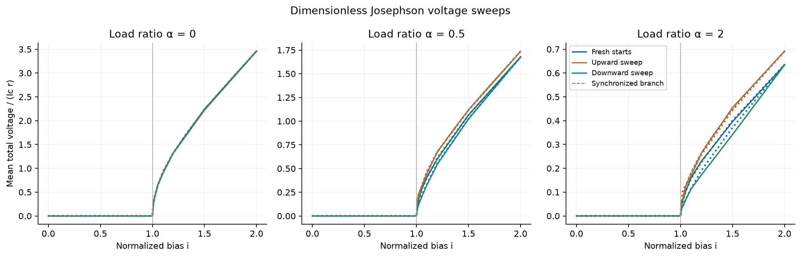
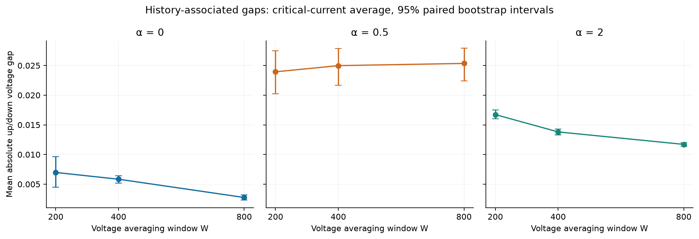

# Josephson voltage sweep: completed numerical experiment

10 October 2026. A separate dimensionless circuit extension to **Streams and Rocks**. This uses the existing conditional overdamped two-junction model; it is not a fluid simulation or laboratory measurement.

## Completed comparisons

- Upward and downward current sweeps and fresh starts, 17 currents, three load ratios and 12 independently drawn initial phase pairs.
- All four time-step/settling combinations: (0.05, 100), (0.025, 100), (0.05, 200), (0.025, 200), with voltage averaging held at W=200.
- Separate averaging windows W=200, 400 and 800, plus disjoint 200-unit blocks. Longer windows never change the continuation endpoint used by the next current.
- 7,344 original fixed-bias segments, 3,672 full-history adaptive-reference segments and 612 targeted finer-step/tolerance segments. Repeated conditions are paired controls, not additional independent starting draws.
- 18 automated tests, 24 new-start solver checks, nine exact synchronized-cycle controls, and recorded current/energy balance checks.

## What happened

**The original numerical checks exposed two problems.** Direct phase coordinates could distort tiny phase separations; an equivalent mean/log-separation formulation fixes that conditioning problem. Then the original step comparison still failed its declared limit in part of the load-ratio 0.5 downward sweep: maximum total-voltage change **0.00136923**, versus a **2e-5** limit.

The failed check is retained. Further steps of **0.0125 and 0.00625**, tighter solver tolerances and full-history adaptive references were actually run. The finest-step/reference maximum total-voltage difference in that history is **5.52501e-07**. All four follow-up refinement gates passed.

The refined calculations still show sensitivity to settling and observation time. The following critical-window gap averages the absolute up/down total-voltage difference over seven sampled currents from 0.98 to 1.02. Brackets are 95% paired bootstrap intervals over the 12 starting draws.

| Load ratio alpha | Gap at W=200 | Gap at W=800 |
|---|---:|---:|
| 0 | 0.006976 [0.004493, 0.009614] | 0.002756 [0.002307, 0.003209] |
| 0.5 | 0.023937 [0.020211, 0.027473] | 0.025355 [0.022438, 0.027911] |
| 2 | 0.016732 [0.016001, 0.017506] | 0.011709 [0.011364, 0.012023] |

These are finite-time, model-specific differences. They do **not** establish asymptotic hysteresis, a physical memory law beyond the full phase state, or a corresponding mechanism in fluids. The intervals quantify initial-phase variability, not uncertainty in a real device. Further fixed-step checks target the history that failed; they do not certify arbitrary longer runs.

## Read and reproduce

- [Full illustrated report](report.html) (GitHub displays HTML source; download the folder and open it locally).
- [Resolved parameter/result table](results/reference_regimes.csv), [all reference voltages](results/reference_voltages.csv), [means and uncertainty](results/reference_means.csv), [window measurements](results/reference_windows.csv).
- [Original four-setting measurements](results/primary_voltages.csv) and [original numerical checks, including the failure](results/verification.json).
- [Additional refinement results](results/refinement.json), [original protocol](protocol.json), [refinement protocol](refinement_protocol.json), [automated tests](tests.xml), [source/data manifest](manifest.json).
- [Streams and Rocks report](https://github.com/NousVolition/Nous-Volition/tree/main/studies/fluid-organization/extensions/josephson-sweep) · [Runnable Python and recorded arrays](https://github.com/NousVolition/My-Sources-Project-ALL/tree/main/reports/fluid-organization-pilot/extensions/josephson-sweep).

Dimensionless Josephson sweep. Solid curves use the initial integration settings; dotted curves use half the step and twice the settling time. Critical-window voltage can remain sensitive to history and observation time. The original step comparison was not uniformly converged; the refined measurements are labeled separately.

## Follow-up status — 10 October 2026

[The separate completed follow-up](../josephson-followups/README.md) now covers longer and whole-cycle observations, stepped/continuous ramps, dimensionless noise and mismatch, a synchronized capacitive branch, held-out circuit forecasts, and a 120-field independent fluid confirmation. Calibrated physical noise, laboratory validation, LRC loads, general capacitive states, other-media studies and demonstrated physical circuit-to-fluid transfer remain future experiments. The original sweep results above remain its historical snapshot.

The executable code and recorded arrays are in the linked source repository.
