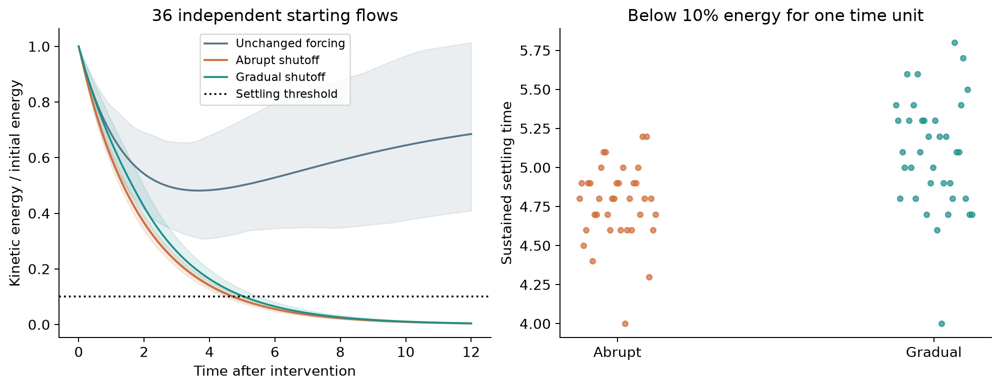
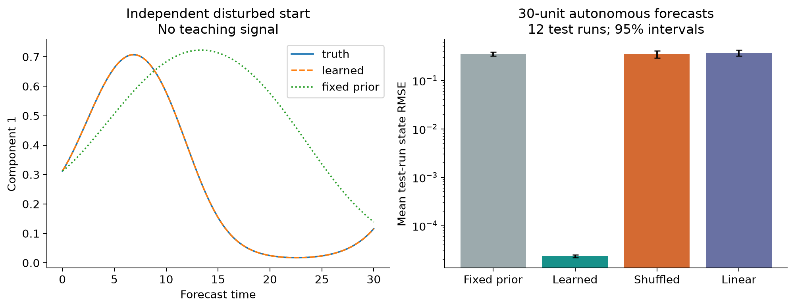

# Recovery and heteroclinic network experiments

Completed numerical extension pilot, 10 October 2026. The original fluid pilot remains unchanged.

## Completed work

- **Fluid:** 36 independent starting fields, each cloned into unchanged, abrupt-shutoff and gradual-shutoff arms; 108 primary post-intervention trajectories. Eight additional three-arm refinement calculations and 12 test-run full-field recurrence replays.
- **Network:** a specified three-saddle GLV cycle, 36 primary paired starts, 40 paired coupling/topology controls and 12 paired integration refinements. This is a separate model, not an identified fluid network or the supplied nine-saddle diagram.
- **Prediction:** 18 training, 6 validation and 12 independent test initializations per system; run-level bootstrap uncertainty, shuffled controls and frozen autonomous network forecasts.
- **Validation:** 14 automated tests; declared energy, incompressibility, time-step and grid gates passed. Refinement covers four fluid seeds, not arbitrary flow regimes.

## Results

Abrupt shutoff reached the sustained 10%-energy threshold in a mean **4.772 model-time units**; gradual shutoff took **5.089**. Both have zero final forcing, but the ramp supplies additional work.

The two fluid prediction targets have separate results:
- `integrated_normalized_energy_0_8`: present RMSE **0.110569**, history RMSE **0.0946732**; paired difference **-0.0158955**, 95% interval **[-0.0304597, -0.00146946]**.
- `integrated_difference_from_unchanged_0_8`: present RMSE **0.189133**, history RMSE **0.172827**; paired difference **-0.0163062**, 95% interval **[-0.114512, 0.0619049]**.

The integrated-recovery history advantage over the capacity-matched shuffled-history control is not statistically resolved; the paired intervention-specific improvement is also unresolved. These remain exploratory findings, not evidence of a new fluid memory law.

The frozen learned network achieved mean state-forecast RMSE **2.34148e-05**, compared with **0.356** for the declared incorrect fixed prior and **0.350313** for shuffled derivative/state training pairs. This favorable control assumes noiseless complete state observations and the correct model class. Full-state dynamics outperform the history-augmented waiting-time regression; no new physical memory mechanism is established.

## Read and reproduce

- [Illustrated report](report.html) (GitHub displays HTML source; download and open locally with the figures).
- [Fluid parameter/result table](results/recovery_runs.csv), [network regimes](results/network_regimes.csv), [prediction results](results/recovery_prediction.json).
- [Protocol](protocol.json), [validation gates](results/verification.json), [automated tests](results/tests.xml), [source/data manifest](manifest.json).
- [Streams and Rocks report](https://github.com/NousVolition/Nous-Volition/tree/main/studies/fluid-organization/extensions/recovery-network) · [Runnable code and all recordings](https://github.com/NousVolition/My-Sources-Project-ALL/tree/main/reports/fluid-organization-pilot/extensions/recovery-network).

## Limits

Smooth transient periodic flows, zero added network noise, a single outgoing network route, four-seed grid controls and small independent test ensembles. The learning method is offline coefficient identification, not a replication of the cited online teacher-coupled adaptation rule. The report lists stronger present-state comparators, nonlinear alternatives, noise, branching networks and independent fluid-state identification as remaining work.

Executable code and recorded arrays are maintained in the linked source repository. The manifest and validation record refer to that complete package.
